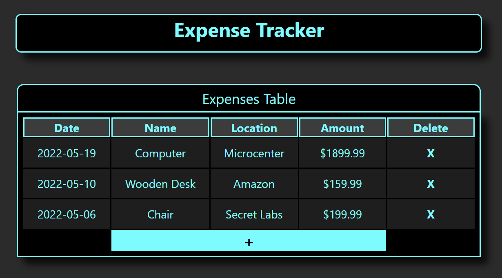

# React Expense Tracker

  ### Fully functional Expense Tracker developed with React
  
 

 ## Summary
 This was my first project using React. There was a lot of time spent understanding core concepts such as state, props, 
 and JSON stringify for local data storage. 
 Overall it was a big adventure and undertaking, but it was a great learning experience!
 
   #### ToDo: Move input forms to a Modal & debug local storage useEffect
 
   ### Try it live [here](https://brandons-expense-tracker.herokuapp.com/)
 
 ## Author 
 Brandon Chamberlain - Apprentice Software Developer | [LinkedIn](https://www.linkedin.com/in/bchamberlain3618/) | 
 [Personal Website](https://www.thebrandonchamberlain.com)
